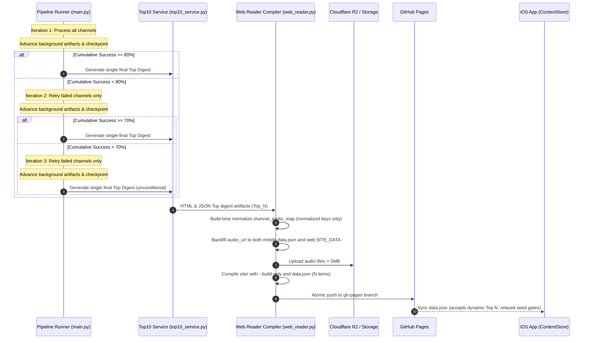

# Implementation Plan: TubeLM Web & Mobile Sync Remediation

## 1. Architectural Strategy & Constraints Anchor
- **Persona & Scale:** Single-user personal app exclusively. Strictly reject enterprise complexity, authentication frameworks, microservices, or complex distributed databases.
- **Host & Environment:**
  - Web Reader: Hosted on GitHub Pages (`https://vkr1729.github.io/TubeLM/`) with data synced via Cloudflare Worker/R2.
  - iOS App: Native Swift/SwiftUI application running in LiveContainer on iOS with offline caching and background Cloudflare sync.
- **Core Principles:**
  - Build-time normalization over client-side fuzzy heuristics.
  - Strict atomic deployment order: audio to R2/Worker first, `data.json` last, single `gh-pages` commit.
  - Always run `--build-only` during UAT to prevent premature deployment pushes.
  - Pre-deploy guard rails: scan for files $> 5\text{MB}$ before pushing; documented recovery via audio compression or R2 upload.
  - Single final Top Digest: zero interim files or notifications; deterministic 3-iteration channel retries.

---

## 2. Pipeline & Data Flow Architecture



---

## 3. Detailed Component Breakdown & Implementation Slices

### Slice 1: Dynamic Top Digest Pattern Matching & Detection
- **Files Affected:**
  - `desktop/paths.py`
  - `desktop/web_reader.py`
  - `desktop/tts_service.py`
  - `desktop/scripts/download_top10.py`
  - `desktop/scripts/send_top10_from_digests.py`
- **Actions:**
  1. In `desktop/paths.py`, define central regex and helper functions:
     ```python
     TOP_DIGEST_FILENAME_RE = re.compile(
         r"^(\d{4}-\d{2}-\d{2})_(?:TubeLM_)?Top_(\d+)_digest\.(html|json)$",
         re.IGNORECASE,
     )

     def is_top_digest_file(filename: str | Path) -> bool:
         name = filename.name if isinstance(filename, Path) else filename
         return bool(TOP_DIGEST_FILENAME_RE.match(name))

     def parse_top_digest_count(filename: str | Path) -> int | None:
         name = filename.name if isinstance(filename, Path) else filename
         m = TOP_DIGEST_FILENAME_RE.match(name)
         return int(m.group(2)) if m else None
     ```
  2. In `desktop/web_reader.py`:
     - Replace hardcoded `if "Top_20" in f.name or "Top_10" in f.name:` (line 1061) with `if paths.is_top_digest_file(f):`.
     - Extract `N = parse_top_digest_count(f) or len(deduped_items)`.
     - In `_normalize_mobile_item` and mobile export (line 1237), export `candidate_count: len(mobile_items)`.
  3. In `desktop/tts_service.py`:
     - Replace `if "Top_20" in digest.name or "Top_10" in digest.name:` (line 255) with `if paths.is_top_digest_file(digest):` so Top digests are never processed as channel digests for TTS.
  4. In `desktop/scripts/download_top10.py`:
     - Update `find_latest_top10_digest()` to filter using `paths.is_top_digest_file`.
  5. In `desktop/scripts/send_top10_from_digests.py`:
     - Preserve exclusion polarity (line 48): `if paths.is_top_digest_file(digest_path): continue`.

### Slice 2: Elimination of Interim Digest & 3-Stage Retry Threshold Policy
- **Files Affected:**
  - `desktop/top10_service.py`
  - `desktop/main.py`
  - `desktop/email_service.py`
  - `desktop/templates/top10_digest.html`
  - `desktop/tests/unit/test_immediate_checkpointing.py`
- **Actions:**
  1. In `desktop/top10_service.py`:
     - Remove `is_interim` and `is_final_after_interim` parameters from `generate_and_send_top10_digest` and `_rank_render_and_send`.
     - Remove interim conditional branches, `_interim` suffix logic, and `final_identical_to_interim` skip block.
     - Always set `rotate_downloads=True` on final send.
     - Maintain tolerant reading for existing batch JSON files that may have `interim_sent_at` or legacy keys, but never write new interim keys.
     - Add `coverage_note` field to the selection dict when `completion_ratio < 1.0` (e.g., *"Digest compiled from 19 of 23 channels (4 channels unavailable or deferred)."*).
  2. In `desktop/email_service.py`:
     - Remove "EARLY EDITION" and "FINAL EDITION" edition labels. Top digest emails represent the single authoritative edition.
     - Render `selection.get("coverage_note")` in the email header/footer if present.
  3. In `desktop/templates/top10_digest.html`:
     - Lines 44 and 60: remove `is_interim` and `is_final_after_interim` conditional headings. Render single authoritative heading and optional `coverage_note`.
  4. In `desktop/main.py`:
     - Startup sweep: purge stale `*_interim_digest.*` files from `downloads/` and `site/`.
     - Remove `interim_top10_sent = False` flag (line 596) and Stage 0 interim trigger block (lines 795-815).
     - Placement of threshold gating: insert **after** `_finish_background_artifacts` and checkpointing (around line 826), before advancing to the next stage delay:
       - Skip gating in `dry_run`.
       - **Iteration 1 (`stage_idx == 0`):**
         - Calculate cumulative rate: `completion_ratio = len(completed_source_keys) / total_initial_handlers`.
         - If `completion_ratio >= 0.80`, log milestone and break from retry loop to digest generation.
       - **Iteration 2 (`stage_idx == 1`):**
         - Retry failed handlers only: `failed_handlers = [h for h in initial_handlers if h.source_key not in completed_source_keys]`.
         - If cumulative `completion_ratio >= 0.70`, log milestone and break from retry loop to digest generation.
       - **Iteration 3 (`stage_idx == 2`):**
         - Retry remaining failed handlers once more.
         - Unconditionally break to digest generation and publish.
     - Quota deferral takes precedence (pauses run without phantom retries; publishes partial digest if candidates exist).
  5. In `desktop/tests/unit/test_immediate_checkpointing.py`:
     - Update lines 177-189 to remove `is_interim True -> False` sequence assertions.

### Slice 3: Web Reader Audio Unification & UI Modernization
- **Files Affected:**
  - `desktop/web_reader.py`
  - `desktop/templates/reader.html`
- **Actions:**
  1. In `desktop/web_reader.py`:
     - Define normalized key helper:
       ```python
       def _normalize_channel_key(name: str) -> str:
           return re.sub(r"[^\w\s]", "", name.lower()).strip()
       ```
     - Populate `channel_audio_map` using normalized keys only (`_normalize_channel_key(ch["name"])` and `_normalize_channel_key(ch["id"])`).
     - Backfill `audio_url` on BOTH mobile items (`_normalize_mobile_item`) AND `top20_data["items"]` in `SITE_DATA` at build time so web Editorial Picks cards have resolved `audio_url`.
     - In `_normalize_mobile_item` and mobile export, set `candidate_count: len(mobile_items)`.
  2. In `desktop/templates/reader.html`:
     - Fix all four `has_audio` gates:
       1. Audio Overview card (`line 2823`): `ch.audio_url || ch.summary_audio_url`
       2. Sidebar audio pulse badge (`lines 2600, 2614`): `(ch.has_audio && ch.audio_url) || ch.summary_audio_url`
       3. Channel directory audio pill (`line 3044`): `(ch.has_audio && ch.audio_url) || ch.summary_audio_url`
       4. Queue filter (`line 3163`): `ch.audio_url || ch.summary_audio_url`
     - Dynamic Header & Empty State:
       - In `renderActiveView()` for `selectedItemId === 'top20'`:
         - If `items.length === 0`: render `<div class="text-center py-20 text-[var(--text-muted)]">No Top picks this week — 0 candidates found.</div>`.
         - If `items.length > 0`: dynamically render `Top ${items.length} curated videos` in subtitle.
     - Dynamic Sidebar Badge:
       - In `renderSidebar()`: update `document.getElementById('top20-count-label').textContent = `${top20Count} items``.
     - Editorial Picks Audio Button:
       - In editorial card footer (lines 2787-2793): add `🎧 Listen` button if `item.audio_url` exists.
     - `buildQueue()`:
       - Include channel in queue if `ch.audio_url || ch.summary_audio_url`.
       - Reuse existing `summary: Boolean` flag (`summary: !ch.audio_url`) to avoid schema clash.
     - `playIndex()` Lifecycle Fix:
       - Remove duplicate `begin()` call on `loadedmetadata`.
       - Await `canplay` / `.play()` promise.
       - Update `isAudioPlaying` and play/pause icons strictly from playback events.
       - Surface playback load errors to mini-player banner instead of silently swallowing with `.catch(() => {})`.

### Slice 4: iOS App Audio Reliability & Dynamic Digest Sync
- **Files Affected:**
  - `ios/Sources/TubeLMCore/Storage/ContentStore.swift`
  - `ios/Sources/TubeLMApp/Views/BriefingView.swift`
  - `ios/Sources/TubeLMApp/Audio/AudioPlayerManager.swift`
  - `ios/Sources/TubeLMApp/Views/RootTabView.swift`
- **Actions:**
  1. In `ContentStore.swift`:
     - Relax all four gates (`loadCachedFeed` line 68, and seed candidate loaders lines 86, 101, 118) to check:
       `if let feed = try? JSONDecoder().decode(DigestFeed.self, from: data), (!feed.channels.isEmpty || !feed.top20.items.isEmpty)`.
       This ensures valid feeds with N=0 top items are never falsely quarantined.
  2. In `BriefingView.swift`:
     - Line 50: remove hardcoded `prefix(20)` (`let topItems = Array(items)`).
     - Render honest empty-state view if `items.isEmpty`: *"No Top picks this week — 0 candidates found."*
  3. In `AudioPlayerManager.swift`:
     - In `playTrack`:
       - If `URL(string: trimmed, relativeTo: Self.feedBaseURL)` returns nil, apply `addingPercentEncoding(withAllowedCharacters: .urlQueryAllowed)`.
       - Retain `player.play()` with `playbackRate`.
       - Observe `AVPlayerItem.status` using item-scoped KVO on `@MainActor` with cleanup on `replaceCurrentItem`.
  4. In `RootTabView.swift`:
     - Keep exact-match `resolveAudioUrl` fallback (build-time normalization now handles punctuation joins upstream).

### Slice 5: Automated Verification, UAT Harness & Release Automation
- **Files Affected:**
  - `desktop/scripts/run_browser_uat.py`
  - `desktop/tests/unit/test_top10_service.py`
  - `desktop/tests/unit/test_web_reader.py`
  - `desktop/tests/unit/test_tts.py`
- **Actions:**
  1. In `desktop/scripts/run_browser_uat.py`:
     - Rewrite target to serve `site/` over a local Python `http.server` on an ephemeral port instead of live/`file://`.
     - Preserve and extend all 13 existing anti-slop/duplication checks:
       - Header displays "Top 14 curated videos" (or dynamic N).
       - Channel list contains zero `TubeLM_Top_*` digest entries.
       - Audio overview cards present and audio element triggers `canplay`.
       - Theme toggle between Light and Dark persists in `localStorage`.
       - Viewports 390px, 768px, and 1280px render cleanly without horizontal overflow.
  2. Update unit tests in `test_top10_service.py`, `test_web_reader.py`, `test_tts.py` to match the interim-free single digest flow and dynamic Top N matching.
  3. Build & Deploy Safety:
     - Always test with `--build-only` first.
     - Scan `site/` for files $> 5\text{MB}$ before push; deploy audio to R2/Worker, write `data.json` last, push `gh-pages`.
     - Verify live `data.json` on GitHub Pages matches local `run_date`.

---

## 4. Verification Plan

### Automated Test Matrix
| Layer | Harness | Target | Success Criteria |
|---|---|---|---|
| Python Unit | `.venv/bin/pytest desktop/tests/unit` | All pipeline modules | Zero failures across collected suite (100% pass) |
| Web Reader UAT | Playwright Headless (`run_browser_uat.py`) | Localhost `site/` (390/768/1280px) | Dynamic N verified, 13 anti-slop checks pass, audio `canplay`, theme persists |
| iOS Core Unit | `cd ios && swift test` | `TubeLMCoreTests` | All tests pass, models and relaxed seed gates intact |
| iOS App CI | GitHub Actions | `build-ios.yml` (macOS runner) | iOS build & test suite passes, `.ipa` artifact generated |
| Live Smoke Check | `curl -s https://vkr1729.github.io/TubeLM/data.json` | Remote GitHub Pages | HTTP 200, valid JSON, `run_date` matches local build |

---

## 5. Contingency & Fallback Strategy
- **If Playwright encounters local audio playback autoplay blocks:**
  - Verify `src` attribute resolves HTTP 200 and listen for `canplay` / `loadedmetadata` event instead of requiring audible sound.
- **If GitHub Pages 5MB limit is triggered:**
  - Pre-deploy scan halts deployment before git push; run with `--compress-audio` or upload to Cloudflare R2.
- **If iOS CI fails on macOS runner:**
  - Inspect GitHub Actions run logs immediately, isolate compiler / Swift syntax issues, apply targeted fixes, and re-push.
