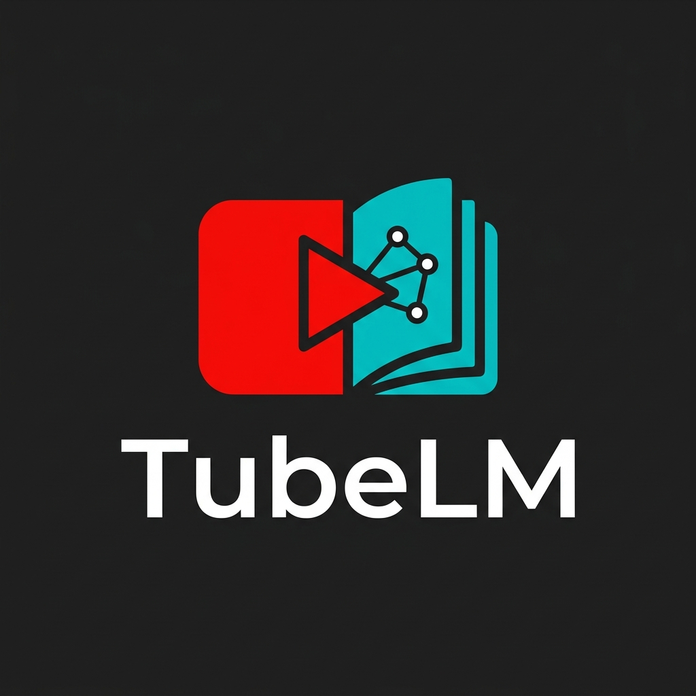
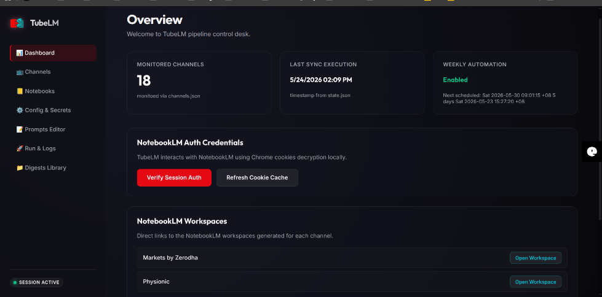
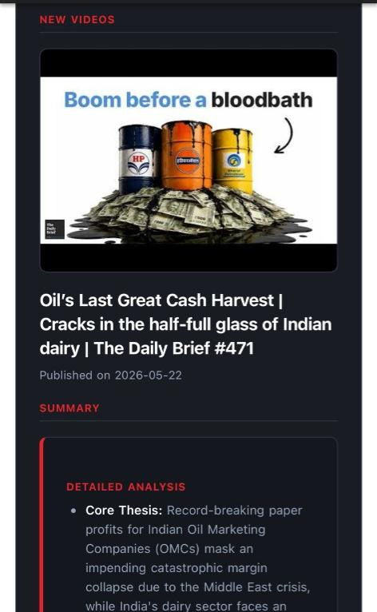
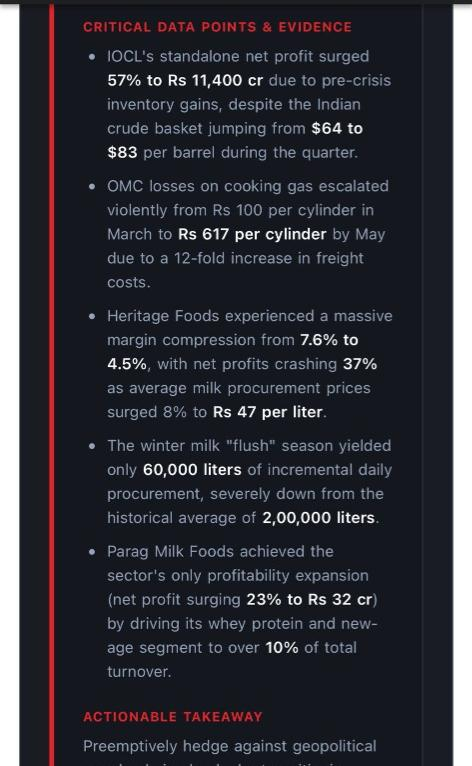
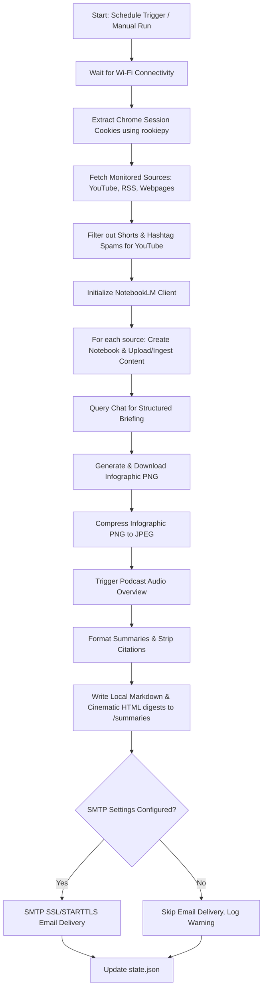

<p align="center">
  
</p>

# 🎬 TubeLM — Premium Multi-Source (YouTube, RSS, Webpages) to NotebookLM Automation Pipeline & Email Digest

[](https://github.com/vkr1729/TubeLM/stargazers)
[](https://opensource.org/licenses/MIT)
[](https://www.python.org/)
[](https://www.kernel.org/)
[](https://github.com/leptonai/notebooklm-py)

**TubeLM** is a production-grade, self-hosted automation pipeline that monitors your favorite YouTube channels, generic RSS feeds, and websites/webpages, programmatically uploading new content to Google's **NotebookLM**. It orchestrates NotebookLM to extract high-yield, citation-clean intelligence summaries, generate custom infographics, trigger podcast Audio Overviews, and deliver a **stunning, dark-mode cinematic HTML newsletter** straight to your inbox.

Designed for busy executives, researchers, developers, and creators who need maximum intelligence from multiple media channels without spending hours reading feeds or dealing with noisy subscription feeds.

---

## 🚀 One-Click Desktop Apps (Windows, macOS, & Linux)

For non-technical users who want to run the TubeLM Web Dashboard **without** using the command line, cloning Git, or installing Python manually:

| macOS (Apple Silicon/Intel) | Windows (10/11) | Linux (Ubuntu/Debian) |
| :---: | :---: | :---: |
| [](https://github.com/vkr1729/TubeLM/releases/latest) | [](https://github.com/vkr1729/TubeLM/releases/latest) | [](https://github.com/vkr1729/TubeLM/releases/latest) |
| **`TubeLM-macOS.zip`** | **`TubeLM-Windows.zip`** | **`tubelm_1.0.0_amd64.deb`** |

### 🍏 macOS Quick Start:
1. **Download:** Get `TubeLM-macOS.zip` from the [Latest Releases](https://github.com/vkr1729/TubeLM/releases/latest).
2. **Unzip:** Extract the `.zip` file on your Mac.
3. **Launch:** Double-click the native **`TubeLM.app`** status bar app! It will silently run in your menu bar (showing a native `📺` icon) and auto-open the dashboard in your default browser.

### 🪟 Windows Quick Start:
1. **Download:** Get `TubeLM-Windows.zip` from the [Latest Releases](https://github.com/vkr1729/TubeLM/releases/latest).
2. **Unzip:** Extract the folder to a safe place (e.g., your Desktop).
3. **Launch:** Double-click the **`TubeLM.exe`** status tray app! It will run in your Windows system taskbar tray (showing a native status icon) and automatically launch the dashboard in your browser.

### 🐧 Ubuntu / Debian Quick Start:
1. **Download:** Get the `tubelm_1.0.0_amd64.deb` installer from the [Latest Releases](https://github.com/vkr1729/TubeLM/releases/latest).
2. **Install:** Double-click the `.deb` package to open Ubuntu Software Center and click **Install**, or run:
   ```bash
   sudo dpkg -i tubelm_1.0.0_amd64.deb
   ```
3. **Launch:** Open your applications menu, search for **TubeLM**, and click the icon to launch!

---

## 📸 Visual Preview

### 🖥️ Local Web Dashboard GUI
Experience a premium, glassmorphic dark-theme control panel to monitor active subscriptions, edit channel timestamps inline, manage Google session cookies, and batch-delete workspaces in parallel:



---

### 📱 Premium Mobile Email Digest (Markets by Zerodha)
Delivers a publication-grade, mobile-optimized HTML newsletter optimized for Gmail/iOS with cinema-style dark cards, high-yield bullet metrics, and native, high-resolution infographics:

| 1. Header & Infographic | 2. Video Card & Thesis | 3. Hard Data Points |
| :---: | :---: | :---: |
|  |  |  |

---

## 🖥️ Local Web Dashboard (GUI)

TubeLM features a premium, glassmorphic local web dashboard to manage your YouTube automation pipeline directly in your browser. The GUI installation is **enabled by default** and serves as the primary way to interact with the pipeline.

### 1. Launching the Dashboard

If installed via the `setup.sh` wizard in **GUI Mode** (default), launch the dashboard with:
```bash
.venv/bin/python main.py --gui
```
This launches a local web server at `http://localhost:5000` (which dynamically falls back to the next available port if `5000` is already in use) and automatically opens a tab in your default browser.

### 2. Dashboard Features

* **📊 Dashboard Overview:** Monitor active subscriptions, check local Google Account session cookies, trigger cookie cache refreshes, and inspect timer logs.
* **📒 NotebookLM Workspaces Manager:**
  * Displays all notebooks on your Google Account grouped by monitored YouTube channel, sorted by date.
  * Allows **manual selection and parallel bulk deletion** using checkboxes and the `Delete Selected (N)` button.
  * Toggles **Select All per Channel** groups or uncategorized groups with modern indeterminate UI support.
* **🚀 Selective Run & Live Logs Console:**
  * View lookback date/time timestamps for each YouTube channel individually.
  * **Edit last run timestamps inline** with a datetime picker or reset them to default lookback windows.
  * Run the pipeline selectively for specific checked channels (e.g. `Physionic` or `Markets by Zerodha`).
  * Watch output logs stream line-by-line in real time via Server-Sent Events (SSE).
* **📺 Monitored Channels:** Add or delete YouTube channels dynamically from the dashboard.
* **⚙️ Configuration & Secrets Editor:** Save email settings, API credentials, and retention rules (e.g. `NOTEBOOKS_RETENTION_LIMIT` to retain the N latest notebooks per channel and auto-prune older ones) directly to `.env`.
* **📅 Automation Controller (Weekly Scheduler):**
  * View whether the background automation timer is enabled or disabled.
  * **Schedule the weekly run** directly from the GUI by selecting a custom **Day of the Week** and **Time** (e.g., Monday at 14:30).
  * Update the active systemd timer dynamically at any time with a single click.
* **📝 Prompts Customizer:** Live-edit research summaries (`Summary_Prompt.md`) and podcast templates (`Podcast_Prompt.md`).
* **📁 Historical Digests Library:** View and read past generated HTML briefings directly in your browser.

---

## 🚀 Key Features

*   **📰 Multi-Source Monitoring & Discovery:**
    *   **YouTube Channels:** Polls YouTube feeds for uploads and filters them.
    *   **Generic RSS/Atom Feeds:** Periodically checks blog or newsletter feeds for new article entries.
    *   **Websites & Webpages:** Tracks individual articles, or scrapes and index-pages complete websites (extracting links dynamically using customizable CSS selector heuristics to process and backfill new articles).
*   **🛡️ Short-form & Spam Filters:** Aggressively filters out TikTok-style Shorts and hashtag spam for YouTube sources using multi-layer heuristics (video length checks via YouTube API, `#shorts` tag filters, and title structure analysis).
*   **🧠 Programmatic NotebookLM Orchestration:**
    *   Creates isolated, dedicated notebooks for each monitored channel/source.
    *   Uploads URLs or clean extracted webpage text asynchronously as grounded sources.
    *   Instructs NotebookLM to synthesize cross-source insights using custom research prompts.
    *   Generates and downloads structural visual infographics.
    *   Triggers background generation of audio podcasts (NotebookLM Audio Overviews).
*   **🖼️ High-Performance Infographic Compression:** Converts large generated PNG infographics (~5MB) to optimized RGB JPEGs (~400KB - 800KB) at 80% quality, dramatically lowering email dispatch latency and disk footprint.
*   **✉️ Cinema-Style HTML Digests:**
    *   Delivers responsive dark-mode emails with dynamic terminology and icons matching the source type (e.g., "New Articles" for RSS, "New Videos" for YouTube, "New Pages" for Webpages).
    *   Features clean heading styling to prevent black/invisible heading text in restrictive mobile email clients.
    *   Supports offline viewing by rendering local HTML copies with relative file paths rather than email `cid:` attachments.
    *   Strips distracting AI citation brackets (e.g. `[12-15]`) for pristine reading flow.
*   **⏰ Saturday Boot & Automation Daemon:** Sets up a persistent local background daemon via systemd user timers. If your machine is off during the scheduled weekly run, the timer triggers **immediately upon boot** once network connectivity is verified.

---

## ⚖️ Why TubeLM?

Most AI-powered YouTube newsletter summaries rely on OpenAI GPT-4 or Anthropic Claude APIs, which can become expensive for long-form video transcripts and lack cross-document grounding.

| Feature | **TubeLM** (NotebookLM) | Standard LLM Summarizers (GPT/Claude API) |
| :--- | :--- | :--- |
| **API Token Cost** | 💰 **$0 (Zero Token Fees)** | 📈 High (billed per-token for long transcripts) |
| **Workspace Grounding** | **Yes** (accumulates sources in a shared notebook) | **No** (stateless API queries) |
| **Audio Overview / Podcasts** | **Yes** (auto-generates standard 2-host audio) | **No** (requires separate audio generation APIs) |
| **Mobile-Optimized Layout** | **Yes** (Cinema dark mode, native Gmail-safe images) | **No** (usually basic plain text or generic markdown) |
| **Privacy First** | **Yes** (Local systemd daemon, credentials in `.env`) | **No** (Requires uploading data to third-party services) |

---

## 🛠️ Installation & Setup

### 1. Prerequisites

*   **Linux / macOS** (systemd is used for the automated weekly scheduler; macOS users can adapt to launchd).
*   **Python 3.10+** (with virtual environment).
*   **Google Chrome** (you must be logged in to your Google Account in Chrome, as cookies are extracted dynamically from your local Chrome profile).

### 2. Interactive Setup Wizard

TubeLM provides an interactive setup script that automatically sets up your virtual environment and installs the required packages.

Clone the repository and run the setup wizard:
```bash
git clone https://github.com/vkr1729/TubeLM.git
cd TubeLM
./setup.sh
```

During installation, you can choose between:
* **Option 1: GUI Mode (Default & Recommended):** Installs all core dependencies and additional packages for the local Web Dashboard GUI.
* **Option 2: Core Only Mode:** A lightweight setup that installs only the core pipeline engine, skipping Flask web dependencies.

### 3. Basic Configuration

1. **Environment Config (`.env`):**
   Copy the example template and fill in your details:
   ```bash
   cp .env.example .env
   nano .env
   ```

2. **Sources Config (`sources.json`):**
   Define the YouTube channels, RSS feeds, or webpage scraping configs you want to monitor (legacy `channels.json` formats are automatically migrated to `sources.json` on startup):
   ```bash
   cp sources.json.example sources.json
   nano sources.json
   ```

   ```json
   [
     {
       "name": "Dr Brad Stanfield",
       "type": "youtube",
       "channel_id": "UCpcvPcHJVOkO9Qp79BOagTg"
     },
     {
       "name": "Simon Willison's Blog",
       "type": "rss",
       "url": "https://simonwillison.net/atom/everything/",
       "max_items": 10
     },
     {
       "name": "Paul Graham Essays",
       "type": "webpage",
       "url": "https://paulgraham.com/articles.html",
       "is_index_page": true,
       "link_selector": "td a[href]",
       "max_items": 5
     }
   ]
   ```

---

## 🔋 Zero-Credential Standalone Local Mode

TubeLM supports a fully offline, **zero-credential local mode**. You do not need to register for Google Cloud APIs or set up custom SMTP servers to use TubeLM. 

If `YOUTUBE_API_KEY` is not provided and SMTP configurations are omitted/empty in your `.env` file:
1. **API Key Bypassed:** TubeLM will skip duration-based video checks (Layer 3) and instead rely on title and tag heuristics to filter out short-form spam.
2. **SMTP Bypassed:** SMTP authentication checks are skipped entirely and no email is sent.
3. **Local Digests Saved:** TubeLM executes the full intelligence analysis pipeline and writes the outputs directly to the local directory:
   - **Markdown Digests:** Written to `summaries/{run_date}_digest.md`.
   - **Cinematic HTML Digests:** Written to `summaries/{run_date}_{channel_name}_digest.html`.

You can view these offline briefs directly in your browser or Markdown reader at any time, allowing you to use TubeLM completely locally and privately out of the box!

---

## ⚙️ Background Automation (systemd user timer)

TubeLM can run as a persistent background daemon that checks for new uploads and processes them on a regular schedule.

### 1. Quick GUI Scheduling (Recommended)
Launch the **Local Web Dashboard**, go to **Config** (or the main controller card), select your preferred **Day of Week** and **Time**, and click **Setup Scheduler Daemon**. The system will dynamically generate and register the user systemd files for you!

### 2. Manual Config (Alternative)
To schedule the runs manually:

1. Write a user service file at `~/.config/systemd/user/youtube-digest.service`:
   ```ini
   [Unit]
   Description=TubeLM Weekly Briefing Sync Service
   After=network-online.target

   [Service]
   Type=oneshot
   ExecStart=/home/YOUR_USER/youtube-project-2/scripts/run_weekly.sh
   StandardOutput=journal
   StandardError=journal
   ```

2. Write a user timer file at `~/.config/systemd/user/youtube-digest.timer` (adjusting Day of Week and Time under `OnCalendar` as desired):
   ```ini
   [Unit]
   Description=Run TubeLM Weekly Sync

   [Timer]
   OnCalendar=Sat *-*-* 08:00:00
   Persistent=true

   [Install]
   WantedBy=timers.target
   ```

3. Enable and start the timer daemon:
   ```bash
   systemctl --user daemon-reload
   systemctl --user enable --now youtube-digest.timer
   ```

---

## 💻 CLI Usage (Non-GUI Core)

For headless or keyboard-driven workflows, you can run the pipeline directly from the command line:

```bash
# Run the full pipeline for all sources (YouTube, RSS, Webpages)
.venv/bin/python main.py

# Run for a specific subset of sources by channel ID, URL, or name
.venv/bin/python main.py --channels "UCj3p_1jOCJXB_L_we-DjLbA,https://simonwillison.net/atom/everything/,Paul Graham Essays"

# Run the pipeline but skip email delivery (saves HTML digests locally under /summaries)
.venv/bin/python main.py --skip-email

# Dry-run: discover new items only, skipping all uploads and AI generations
.venv/bin/python main.py --dry-run
```

---

## 🗺️ System Flow Architecture



---

## 💬 Frequently Asked Questions (FAQ)

### Is there an official NotebookLM API?
No, Google does not provide an official API for NotebookLM. TubeLM automates interactions securely through a Python automation interface utilizing cookie extraction (`rookiepy`) from your local logged-in Chrome profile.

### How are cookies handled? Is it secure?
All authentication is handled locally. TubeLM extracts the active Google NotebookLM session cookie from your machine's Chrome database. It does not store, request, or transmit your Google password or credentials to any third party.

### Can I customize the prompts?
Absolutely. The structure and style of the summaries and podcasts are driven by two Markdown files in the root folder:
*   [Summary_Prompt.md](Summary_Prompt.md): Configures the bullet structure, clinical/tech highlights, and key thesis sections.
*   [Podcast_Prompt.md](Podcast_Prompt.md): Modifies the tone, conversational layout, and dynamic of the two-host Audio Overview.

### Does this cost anything to run?
No. Unlike standard pipelines that charge you per-token to send transcripts to GPT-4, Google NotebookLM is completely free, meaning you can summarize hours of long-form video content without incurring API fees.

---

## 📄 License

Distributed under the MIT License. See [LICENSE](LICENSE) for more details.
