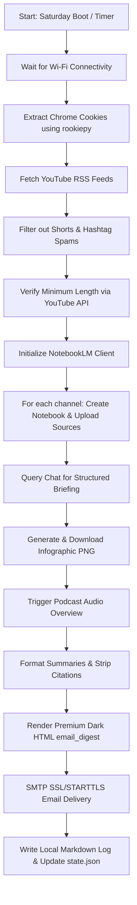

<p align="center">
  
</p>

# 🎬 TubeLM — Premium YouTube to NotebookLM Digest Pipeline

[](https://opensource.org/licenses/MIT)
[](https://www.python.org/)
[](https://www.kernel.org/)
[](https://github.com/leptonai/notebooklm-py)

An elite, automated intelligence briefing service translating YouTube subscriptions into high-density NotebookLM digests. Delivered weekly directly to your inbox in a stunning, custom-styled dark-mode cinematic theme.

Designed for busy executives, researchers, and content creators who need high-yield insights from video content without the noise of video feeds.

---

## 📸 Visual Preview

Here is an example of the rich **Premium Dark** cinematic HTML email digest delivered directly to Gmail/iOS Mail:


---

## 🚀 Key Features

*   **📰 Smart RSS Video Discovery:** Monitors YouTube feeds dynamically based on a customizable lookback window.
*   **🛡️ Multi-Layer Shorts Filtering:** Aggressively filters out short-form vertical content via:
    1.  *Keyword checks* (e.g. `#shorts` tags in titles/descriptions).
    2.  *Hashtag density heuristics* (filters out spammy/hashtag-heavy titles).
    3.  *YouTube Data API duration queries* (ensures videos meet a minimum length threshold, e.g., $>180$ seconds).
*   **🧠 Automated NotebookLM Orchestration:**
    *   Creates separate notebooks for each channel.
    *   Adds video URLs as sources (with asynchronous, non-blocking batch uploads).
    *   Queries NotebookLM's chat interface with custom research prompts.
    *   Generates landscape visual infographics and downloads them automatically.
    *   Triggers background generation of Audio Overviews (NotebookLM podcasts).
*   **✉️ Premium HTML Digests:** Delivers executive emails using a **Netflix-inspired Dark Cinematic Theme** featuring:
    *   Inline high-quality YouTube cover thumbnails (designed with mobile-safe native image support).
    *   **Per-video summaries** located immediately under each video card (no generic bottom dumps).
    *   Zero-dependency markdown parsing (translating AI bullet-points, bold text, and categories into clean styled HTML).
    *   No citation bracket noise (automatically strips citation numbers like `[12-15]` for peak executive scannability).
*   **⏰ Set-and-Forget Automation:** Runs silently in the background using systemd timers. Includes a **network wait daemon** (handles laptop Wi-Fi delays) and **Persistent timer recovery** (triggers immediately on boot if the laptop was off during the scheduled time).

---

## 🗺️ System Flow Architecture



---

## 🛠️ Quick Start

### 1. Prerequisites

*   **Linux or macOS** (systemd is required for the automated service; macOS supports launchd equivalents).
*   **Python 3.10+** (with virtualenv).
*   **Google Chrome** (you must remain logged in to your Google Account/NotebookLM in Chrome; cookies are extracted dynamically from your local Chrome profile).

### 2. Installation

Clone the repository and initialize the virtual environment:

```bash
git clone https://github.com/vkr1729/TubeLM.git
cd TubeLM

# Create virtual environment
python3 -m venv .venv
source .venv/bin/activate

# Install dependencies (includes browser support for cookie extraction)
pip install -r requirements.txt
```

### 3. Configuration

1. Copy the example environment file and configure your SMTP credentials, target recipient, and YouTube API keys:

```bash
cp .env.example .env
nano .env
```

#### Environment Reference (`.env`):
```ini
# SMTP Configuration
SMTP_SERVER=smtp.gmail.com
SMTP_PORT=587
SMTP_USERNAME=your.email@gmail.com
SMTP_PASSWORD=your_app_specific_password
SENDER_EMAIL=your.email@gmail.com
RECIPIENT_EMAIL=recipient.email@gmail.com

# YouTube Data API (v3) Key
YOUTUBE_API_KEY=AIzaSyYourKeyHere

# Files (Optional defaults)
CHANNELS_FILE=channels.json
STATE_FILE=state.json
```

2. Copy the example channels configuration and specify the name and YouTube channel ID for each target creator you want to follow:

```bash
cp channels.json.example channels.json
nano channels.json
```

#### Configure Target Channels (`channels.json`):
```json
[
  { "name": "Physionic", "channel_id": "UCj3p_1jOCJXB_L_we-DjLbA" },
  { "name": "Doctor Alex", "channel_id": "UCGLAPJjQh7ege-N08u_GZrg" }
]
```

---

## ⚙️ Setting Up Saturdays Automation (systemd)

To make the script run completely automatically when you open your laptop on a Saturday, configure a systemd user service.

1. Create a service file at `~/.config/systemd/user/youtube-digest.service`:
```ini
[Unit]
Description=TubeLM Weekly Briefing Sync Service
After=network-online.target

[Service]
Type=oneshot
ExecStart=/home/YOUR_USER/youtube-project-2/scripts/run_weekly.sh
StandardOutput=journal
StandardError=journal
```

2. Create a timer file at `~/.config/systemd/user/youtube-digest.timer`:
```ini
[Unit]
Description=Run TubeLM Weekly Sync

[Timer]
OnCalendar=Sat *-*-* 08:00:00
Persistent=true

[Install]
WantedBy=timers.target
```

3. Enable and start the timer:
```bash
systemctl --user daemon-reload
systemctl --user enable --now youtube-digest.timer
```

Now, the system will monitor the schedule. If your laptop is turned off at 8:00 AM on Saturday, the `Persistent=true` directive ensures the script fires **immediately** the next time you boot up and log in.

---

## 📝 Customizing Prompts

You can override the default summaries and podcast outlines by modifying the templates in your project root:
*   **`Summary_Prompt.md`**: Directs how NotebookLM parses transcripts into key theses, clinical data points, and takeaways.
*   **`Podcast_Prompt.md`**: Directs the conversational style, host dynamics, and structure of the Audio Overviews.

---

## 📄 License

Distributed under the MIT License. See [LICENSE](LICENSE) for more information.
