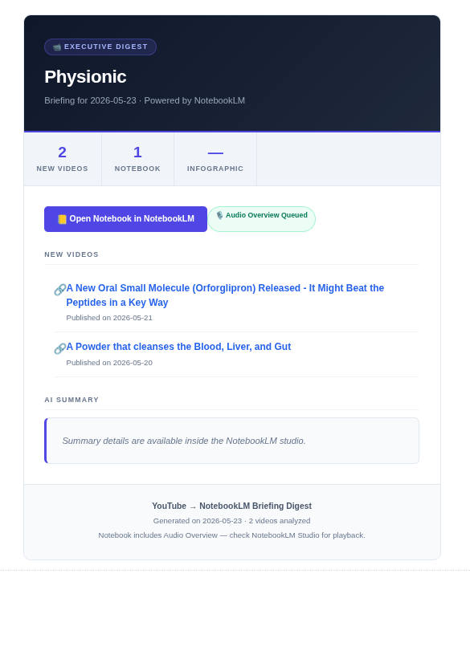
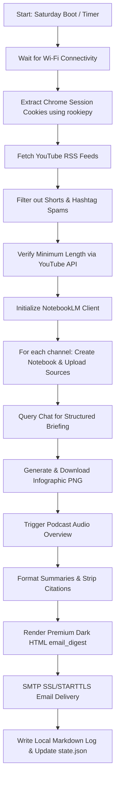

<p align="center">
  
</p>

# 🎬 TubeLM — Premium YouTube to NotebookLM Automation Pipeline & Email Digest

[](https://github.com/vkr1729/TubeLM/stargazers)
[](https://opensource.org/licenses/MIT)
[](https://www.python.org/)
[](https://www.kernel.org/)
[](https://github.com/leptonai/notebooklm-py)

**TubeLM** is a production-grade, self-hosted automation pipeline that monitors your favorite YouTube channels, fetches new uploads, and programmatically uploads them to Google's **NotebookLM**. It orchestrates NotebookLM to extract high-yield, citation-clean intelligence summaries, generate custom infographics, trigger podcast Audio Overviews, and deliver a **stunning, dark-mode cinematic HTML newsletter** straight to your inbox.

Designed for busy executives, researchers, developers, and creators who need maximum intelligence from video uploads without spending hours watching streams or dealing with noisy subscription feeds.

---

## 📸 Visual Preview

Enjoy a premium, publication-grade executive summary formatted in a **Netflix-inspired Dark Cinematic Theme** optimized for mobile Gmail/iOS:



---

## 🚀 Key Features

*   **📰 Automated RSS Channel Monitoring:** Regularly polls YouTube RSS feeds for new uploads based on custom lookback schedules.
*   **🛡️ Short-form & Spam Filters:** Aggressively filters out TikTok-style Shorts and hashtag spam using multi-layer heuristics (video length verify checks via YouTube API, `#shorts` tag filters, and title structure analysis).
*   **🧠 Programmatic NotebookLM Orchestration:**
    *   Creates isolated, dedicated notebooks for each monitored YouTube channel.
    *   Uploads video URLs asynchronously as grounded sources.
    *   Instructs NotebookLM to synthesize cross-source insights using custom research prompts.
    *   Generates and downloads structural visual infographics.
    *   Triggers background generation of audio podcasts (NotebookLM Audio Overviews).
*   **✉️ Cinema-Style HTML Digests:**
    *   Delivers responsive dark-mode emails featuring native `` thumbnails (mobile-safe layout verified in Gmail & Apple Mail).
    *   Displays video summaries directly below each individual video card for quick scannability.
    *   Zero-dependency markdown parser formats headers, bullet points, and key metrics.
    *   Cleans and strips AI citation numbers (e.g. `[12-15]`) for peak text scannability.
*   **⏰ Saturday Boot & Automation Daemon:** Sets up a persistent local background daemon via systemd user timers. If your machine is off during the scheduled Saturday run, the timer triggers **immediately upon boot** once network connectivity is verified.

---

## ⚖️ Why TubeLM?

Most AI-powered YouTube newsletter summaries rely on OpenAI GPT-4 or Anthropic Claude APIs, which can become expensive for long-form video transcripts and lack cross-document grounding.

| Feature | **TubeLM** (NotebookLM) | Standard LLM Summarizers (GPT/Claude API) |
| :--- | :--- | :--- |
| **API Token Cost** | 💰 **$0 (Zero Token Fees)** | 📈 High (billed per-token for long transcripts) |
| **Workspace Grounding** | **Yes** (accumulates sources in a shared notebook) | **No** (stateless API queries) |
| **Audio Overview / Podcasts** | **Yes** (auto-generates standard 2-host audio) | **No** (requires separate audio generation APIs) |
| **Mobile-Optimized Layout** | **Yes** (Cinema dark mode, native Gmail-safe images) | **No** (usually basic plain text or generic markdown) |
| **Privacy First** | **Yes** (Local systemd daemon, credentials in `.env`) | **No** (Requires uploading data to third-party services) |

---

## 🗺️ System Flow Architecture



---

## 🛠️ Quick Start

### 1. Prerequisites

*   **Linux / macOS** (systemd is used for the automated weekly scheduler; macOS users can adapt to launchd).
*   **Python 3.10+** (with virtual environment).
*   **Google Chrome** (you must be logged in to your Google Account in Chrome, as cookies are extracted dynamically from your local Chrome profile).

### 2. Installation

```bash
git clone https://github.com/vkr1729/TubeLM.git
cd TubeLM

# Initialize virtual environment
python3 -m venv .venv
source .venv/bin/activate

# Install dependencies (includes cookie decryptors and headless browser utilities)
pip install -r requirements.txt
```

### 3. Setup Configuration

1. **Environment Config (`.env`):**
   Copy the example template and fill in your SMTP credentials, recipient addresses, and YouTube API key:
   ```bash
   cp .env.example .env
   nano .env
   ```

   ```ini
   # SMTP Email Settings
   SMTP_SERVER=smtp.gmail.com
   SMTP_PORT=587
   SMTP_USERNAME=your.email@gmail.com
   SMTP_PASSWORD=your_app_specific_password
   SENDER_EMAIL=your.email@gmail.com
   RECIPIENT_EMAIL=recipient.email@gmail.com

   # YouTube API Key (v3)
   YOUTUBE_API_KEY=AIzaSyYourAPIKeyHere

   # Local database / config paths
   CHANNELS_FILE=channels.json
   STATE_FILE=state.json
   ```

2. **Channel Config (`channels.json`):**
   Define the channels you want to monitor (we recommend keeping your personal channel list private and adding `channels.json` to `.gitignore`):
   ```bash
   cp channels.json.example channels.json
   nano channels.json
   ```

   ```json
   [
     { "name": "Physionic", "channel_id": "UCj3p_1jOCJXB_L_we-DjLbA" },
     { "name": "Doctor Brad Stanfield", "channel_id": "UCZ0zZ_A30TDFn9-K_n-mP2g" }
   ]
   ```

---

## ⚙️ Background Automation (systemd user timer)

To set up TubeLM as a persistent background daemon that runs automatically every Saturday morning (or immediately when you open your laptop if it was offline during the schedule):

1. Write a user service file at `~/.config/systemd/user/youtube-digest.service`:
   ```ini
   [Unit]
   Description=TubeLM Weekly Briefing Sync Service
   After=network-online.target

   [Service]
   Type=oneshot
   ExecStart=/home/YOUR_USER/youtube-project-2/scripts/run_weekly.sh
   StandardOutput=journal
   StandardError=journal
   ```

2. Write a user timer file at `~/.config/systemd/user/youtube-digest.timer`:
   ```ini
   [Unit]
   Description=Run TubeLM Weekly Sync

   [Timer]
   OnCalendar=Sat *-*-* 08:00:00
   Persistent=true

   [Install]
   WantedBy=timers.target
   ```

3. Enable the daemon:
   ```bash
   systemctl --user daemon-reload
   systemctl --user enable --now youtube-digest.timer
   ```

---

## 💬 Frequently Asked Questions (FAQ)

### Is there an official NotebookLM API?
No, Google does not provide an official API for NotebookLM. TubeLM automates interactions securely through a Python automation interface utilizing cookie extraction (`rookiepy`) from your local logged-in Chrome profile.

### How are cookies handled? Is it secure?
All authentication is handled locally. TubeLM extracts the active Google NotebookLM session cookie from your machine's Chrome database. It does not store, request, or transmit your Google password or credentials to any third party.

### Can I customize the prompts?
Absolutely. The structure and style of the summaries and podcasts are driven by two Markdown files in the root folder:
*   [Summary_Prompt.md](Summary_Prompt.md): Configures the bullet structure, clinical/tech highlights, and key thesis sections.
*   [Podcast_Prompt.md](Podcast_Prompt.md): Modifies the tone, conversational layout, and dynamic of the two-host Audio Overview.

### Does this cost anything to run?
No. Unlike standard pipelines that charge you per-token to send transcripts to GPT-4, Google NotebookLM is completely free, meaning you can summarize hours of long-form video content without incurring API fees.

---

## 🏷️ Recommended GitHub Topics / SEO Tags
For developers hosting and publishing the repository, add the following tags to maximize GitHub feed discovery:
`youtube-to-email`, `notebooklm`, `notebooklm-api`, `automation-script`, `newsletter-generator`, `youtube-summarizer`, `ai-digest`, `systemd-timer`, `rss-reader`, `email-newsletter`.

---

## 📄 License

Distributed under the MIT License. See [LICENSE](LICENSE) for more details.
