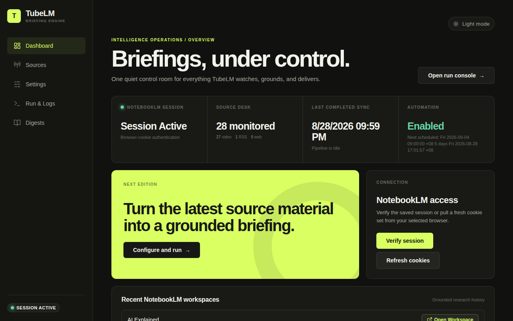
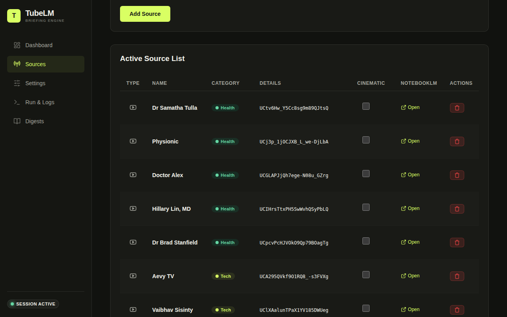
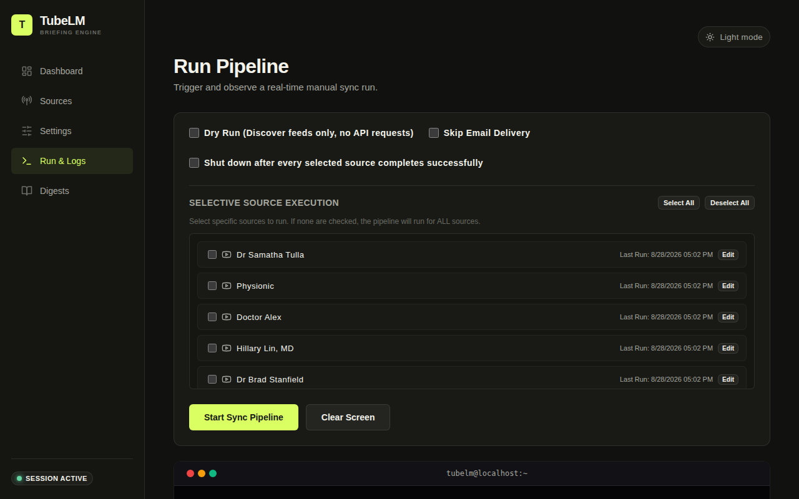

# TubeLM

**Version 3.0.0**

TubeLM is my personal, Linux-first pipeline for turning new YouTube videos, RSS
articles, and webpages into grounded NotebookLM briefings.

The useful work happens in this order:

1. Discover new source material.
2. Create or resume the NotebookLM notebook and generate its summary.
3. Save the local digest and send the summary email immediately.
4. Generate eligible Audio Overviews and selected Cinematic Videos in the
   background.
5. Resume unfinished artifact work after quota refreshes or computer restarts.

There are no packaged installers or cross-platform release builds. This repository
runs directly from a Python virtual environment. Anyone using another operating
system should adapt the launch and scheduling pieces for their own machine.

## Current interface

These screenshots are generated from the live app by the GUI E2E test.

### Dashboard



### Sources and Cinematic selection



### Selective runs and live logs



The dashboard also has a responsive mobile layout:
[mobile screenshot](shared/assets/current-ui/04_mobile_dashboard.png).

## What it does

- Monitors YouTube channels, RSS feeds, and webpages.
- Filters YouTube Shorts using the YouTube Data API.
- Creates grounded NotebookLM summaries using category-specific prompts.
- Sends a clean HTML digest to one configured email address before artifact work.
- Generates Audio Overviews only when a notebook contains more than one source.
- Generates Cinematic Videos only for sources enabled in the dashboard.
- Keeps infographic support in the code, disabled by default.
- Downloads the completed weekly Cinematic batch to
  `~/Downloads/TorBox/TubeLM` and moves the previous batch to `TubeLM_Prev`.
- Persists pipeline checkpoints and NotebookLM retry times under `~/.tubelm`.
- Sends separate weekly Audio and Cinematic completion emails with NotebookLM
  links.

## Setup

The current setup assumes Linux, Python 3.10 or newer, Chrome, and a Google account
that can access NotebookLM.

```bash
git clone https://github.com/vkr1729/TubeLM.git
cd TubeLM

python3 -m venv .venv
.venv/bin/pip install --upgrade pip
.venv/bin/pip install -r desktop/requirements.txt

cp .env.example .env
cp sources.json.example sources.json
```

Fill in `.env` with SMTP credentials and a YouTube Data API key. Then authenticate
the NotebookLM client from the browser session you already use:

```bash
.venv/bin/notebooklm login --browser-cookies chrome
```

Start the dashboard:

```bash
./tubelm-launch.sh
```

Or launch it directly:

```bash
.venv/bin/python desktop/main.py --gui
```

Open `http://127.0.0.1:5000` if the browser does not open automatically.

## Configuration

Use the dashboard for day-to-day changes. The two local files are:

- `.env` — SMTP, email recipient, YouTube API key, browser choice, and optional
  settings.
- `sources.json` — monitored sources, categories, limits, and the per-source
  `generate_cinematic_video` flag.

Both files are ignored by Git. Templates are provided as `.env.example` and
`sources.json.example`.

Category prompt defaults live in:

```text
shared/prompts/
├── summary/
└── podcast/
```

Edits made through the dashboard are stored in `~/.tubelm/prompts`, leaving the
repository defaults untouched.

## Running the pipeline

```bash
# Safe discovery only: no notebooks, emails, or artifacts
.venv/bin/python desktop/main.py --dry-run

# Full run
.venv/bin/python desktop/main.py

# Run selected source names, IDs, or URLs
.venv/bin/python desktop/main.py --sources "Doctor Alex,Physionic"

# Continue a persisted request
.venv/bin/python desktop/main.py --resume
```

The dashboard can install and manage the weekly `systemd --user` timer used on this
machine. `run_weekly.sh` is the small wrapper used for manual Linux scheduling.

## Artifact and quota behavior

Digest delivery does not wait for Studio artifacts.

Audio and Cinematic Video use separate durable queues, so exhausting the video
allowance does not prevent Audio from being attempted. When NotebookLM reports a
compute limit, TubeLM stores the first safe retry time. Turning the laptop off does
not restart that wait; the persisted request is checked again after login or by the
user service.

Already-accepted server-side artifacts are polled rather than submitted again.
Completed videos use this naming convention:

```text
TubeLM 03 - Doctor Alex - NotebookLM Video Title.mp4
```

## Repository layout

```text
desktop/
├── main.py                    # Pipeline entry point
├── gui.py                     # Local dashboard and API
├── notebooklm_service.py      # Notebook and summary operations
├── weekly_audio_service.py    # Durable Audio queue
├── weekly_video_service.py    # Durable Cinematic queue and downloads
├── source_handlers/           # YouTube, RSS, and webpage discovery
├── templates/                 # Dashboard and email HTML
└── tests/                     # Focused unit and integration checks

shared/prompts/                # Category prompt defaults
run_weekly.sh                  # Personal weekly runner
tubelm-launch.sh               # Personal dashboard launcher
```

## Development checks

```bash
.venv/bin/pip install -r desktop/requirements-dev.txt
PYTHONPATH=desktop .venv/bin/python -m pytest desktop/tests -q
PYTHONPATH=desktop .venv/bin/python desktop/scripts/test_gui_e2e.py
PYTHONPATH=desktop .venv/bin/python desktop/main.py --dry-run
```

GitHub Actions runs only compilation and the Python test suite. It does not build or
publish installers.

## Security

Never commit `.env`, `sources.json`, NotebookLM cookies, generated summaries, or
files from `~/.tubelm`. Log messages intentionally avoid printing credentials.

## License

MIT — see [LICENSE](LICENSE).
