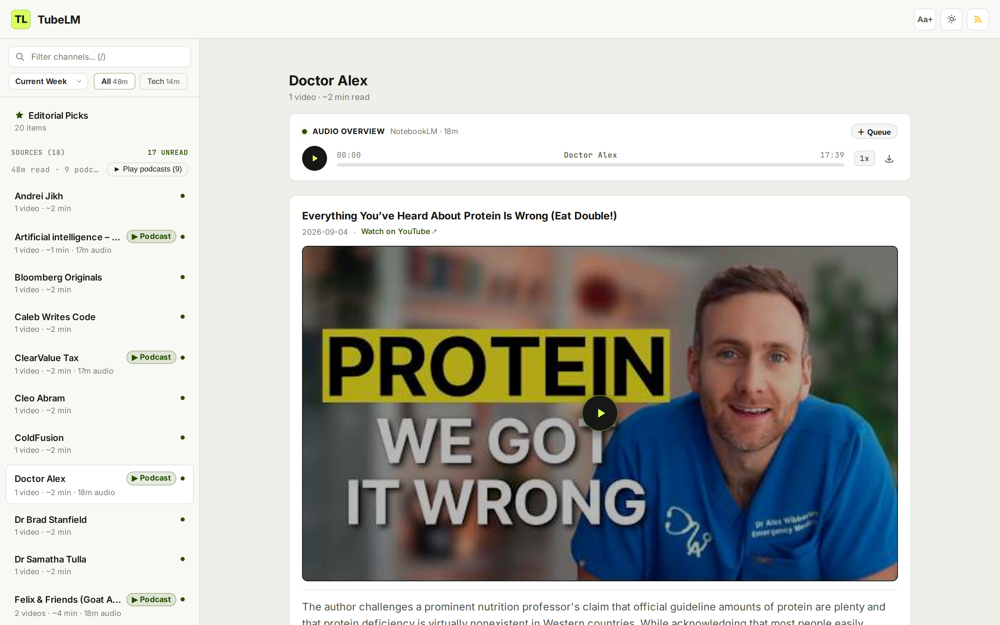
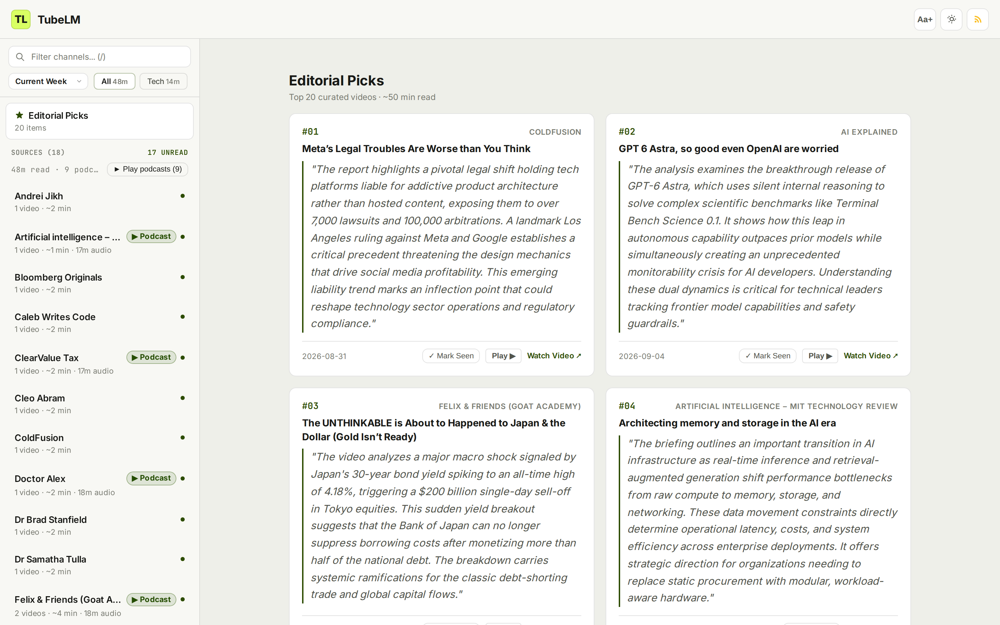
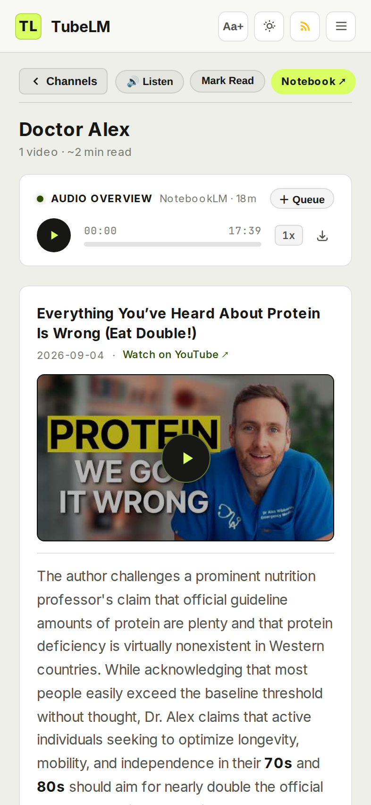
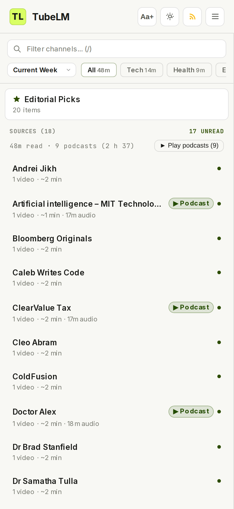
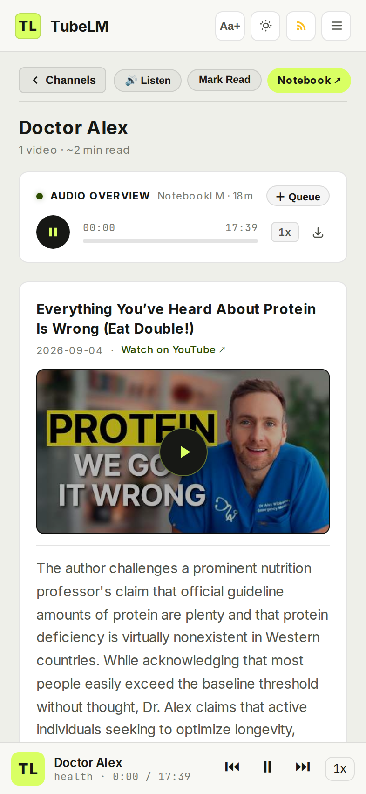
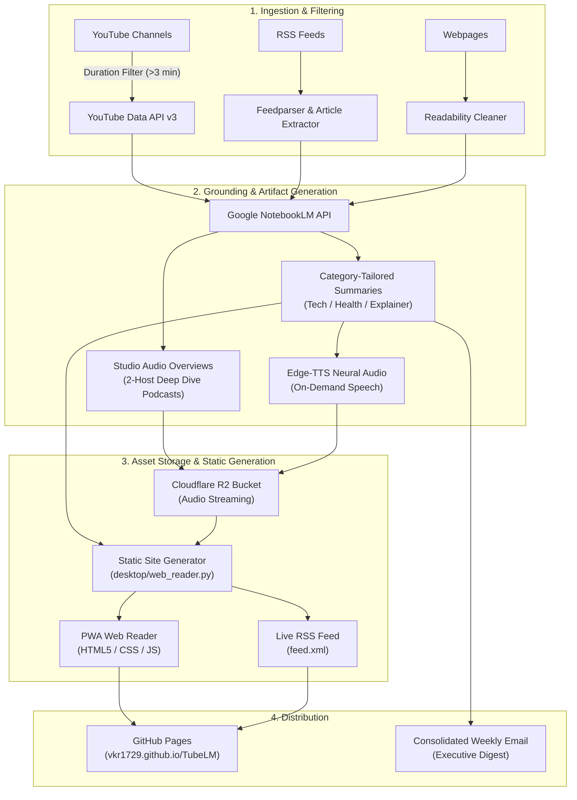

# TubeLM

<div align="center">


### Autonomous Intelligence Briefing Pipeline, Audio Studio & Modern Web Reader

[](VERSION)
[](desktop/tests)
[](https://www.python.org/)
[](LICENSE)
[](https://vkr1729.github.io/TubeLM/)

**Turn monitored YouTube channels, RSS feeds, and technical web publications into grounded Google NotebookLM executive summaries, 2-host podcast discussions, neural audio briefings, and an editorial Progressive Web App.**

[Explore Live Web Reader](https://vkr1729.github.io/TubeLM/) · [Architecture](#architecture) · [Key Features](#key-features) · [Quickstart](#quickstart) · [Configuration](#configuration)

</div>

---

## Visual Showcase (Light Mode)

TubeLM features an editorial, high-performance static Web Reader designed with modern typography, crisp contrast, and tactile micro-interactions.

### Desktop Dual-Pane Reader
*Side-by-side navigation, integrated NotebookLM Studio Audio Overview player, speed controls, on-demand neural audio, and formatted briefing cards.*



### Curated Top 20 Editorial Magazine
*Cross-channel ranking highlighting the top 20 most impactful insights of the week for rapid 5-minute executive scanning.*



### Mobile Experience (PWA)
*Engineered for mobile reading and listening on the go with zero framework overhead.*

<div align="center">
  
  
  
</div>

---

## Why TubeLM?

Information overload across YouTube, technical newsletters, and RSS feeds makes keeping up with high-signal content exhausting. 

**TubeLM solves this end-to-end:**
1. **Curates without distraction:** Eliminates YouTube Shorts and clickbait using duration filtering.
2. **Deep comprehension:** Feeds full video transcripts and long-form articles into **Google NotebookLM** for grounded, hallucination-free summaries tailored by domain (*Tech*, *Health*, *Deep Explainer*).
3. **Studio Podcasts & Neural Audio:** Automatically triggers NotebookLM 2-host audio overviews for deep listening, and generates Microsoft Edge Neural TTS audio for instant article listening.
4. **Lean, Zero-Spam Delivery:** Replaces floods of individual channel notification emails with a single consolidated weekly executive brief and an offline-capable PWA deployed directly to **GitHub Pages**.
5. **Ultra-Lightweight Static Architecture:** The client web reader is pure vanilla HTML5/CSS/JS (<1MB footprint), hosted free on GitHub Pages, backed by Cloudflare R2 for fast audio streaming.

---

## Key Features

### 🎧 NotebookLM Studio Podcasts & Neural TTS
- **NotebookLM Audio Overviews:** Generates engaging two-host podcast deep-dives from multi-video notebooks.
- **Accurate Duration Engine:** Native container duration analysis via `ffprobe` and 256 kbps DASH/AAC detection guarantees exact track timestamps.
- **On-Demand Neural TTS:** Microsoft Edge-TTS engine synthesizes natural speech for all text summaries at the tap of a button.
- **Continuous Queueing & Mini-Player:** Seamlessly queue up unread podcasts or summaries with a persistent sticky mini-player and lock-screen `MediaSession` controls.

### 📱 Modern Mobile Web Reader (PWA)
- **Zero-Framework Speed:** Vanilla HTML5, modern CSS variables, and native JavaScript ensure sub-50ms page loads and zero bundle overhead.
- **PWA & iOS Safari Ready:** Includes high-resolution Apple touch icons, web app manifest, and black-translucent system bars for native app feel.
- **Reading Comfort:** Dynamic font-size stepper (`Aa`, `Aa+`, `AA`) and instant light/dark mode switcher (persisted in `localStorage`, defaults to clean light mode).
- **Session Progress Tracking:** Unread indicators, read/heard tracking, and channel-level unread counters.
- **Live RSS Syndication:** Automatically publishes `feed.xml` for subscribing via NetNewsWire, Reeder, or any RSS client.

### ⚡ Automated Ingestion & Autonomous Resumption
- **Smart YouTube Filtering:** Discards Shorts (<3 minutes) using the YouTube Data API v3 before burning compute.
- **RSS & Web Article Extraction:** Ingests newsletters, blogs, and documentation pages with clean HTML-to-text extraction.
- **Rolling 2-Week Retention:** Automatically prunes local digests and NotebookLM notebooks older than 14 days to prevent quota bloat.
- **Durable Checkpoints:** Persists pipeline state under `~/.tubelm/` with automatic exponential backoff on Google API rate limits.
- **Automated GitHub Pages Deploy:** Directly pushes the compiled site to the `gh-pages` branch on completion.

---

## Architecture


```mermaid
flowchart TD
    subgraph INGESTION ["1. Ingestion & Filtering"]
        YT["YouTube Channels"] -->|"Duration Filter (>3 min)"| YTF["YouTube Data API v3"]
        RSS["RSS Feeds"] --> RSSF["Feedparser & Article Extractor"]
        WEB["Webpages"] --> WEBF["Readability Cleaner"]
    end

    subgraph NOTEBOOKLM ["2. Grounding & Artifact Generation"]
        YTF & RSSF & WEBF --> NBLM["Google NotebookLM API"]
        NBLM --> SUM["Category-Tailored Summaries\n(Tech / Health / Explainer)"]
        NBLM --> POD["Studio Audio Overviews\n(2-Host Deep Dive Podcasts)"]
        SUM --> TTS["Edge-TTS Neural Audio\n(On-Demand Speech)"]
    end

    subgraph SYNC ["3. Asset Storage & Static Generation"]
        POD & TTS --> R2["Cloudflare R2 Bucket\n(Audio Streaming)"]
        SUM & R2 --> GEN["Static Site Generator\n(desktop/web_reader.py)"]
        GEN --> SITE["PWA Web Reader\n(HTML5 / CSS / JS)"]
        GEN --> RSS_OUT["Live RSS Feed\n(feed.xml)"]
    end

    subgraph DELIVERY ["4. Distribution"]
        SITE & RSS_OUT --> GHP["GitHub Pages\n(vkr1729.github.io/TubeLM)"]
        SUM --> MAIL["Consolidated Weekly Email\n(Executive Digest)"]
    end
```

---

## Quickstart

### Prerequisites
- **OS:** Linux (Ubuntu/Debian recommended) or macOS
- **Python:** 3.10, 3.11, or 3.12
- **Google Account:** With access to [NotebookLM](https://notebooklm.google.com/)
- **Browser:** Google Chrome (for initial cookie session extraction)

### 1. Clone and Install

```bash
git clone https://github.com/vkr1729/TubeLM.git
cd TubeLM

python3 -m venv .venv
source .venv/bin/activate
pip install --upgrade pip
pip install -r desktop/requirements.txt
```

### 2. Configure Environment

Copy the example configuration files:

```bash
cp .env.example .env
cp sources.json.example sources.json
```

Edit `.env` with your credentials:
```bash
# SMTP for weekly executive briefing
SMTP_SERVER=smtp.gmail.com
SMTP_PORT=587
SMTP_USERNAME=you@gmail.com
SMTP_PASSWORD=your-app-password
RECIPIENT_EMAIL=you@gmail.com

# YouTube Data API Key (free tier quota is plenty)
YOUTUBE_API_KEY=your-youtube-api-key

# Cloudflare R2 (optional for remote audio hosting)
R2_ACCOUNT_ID=your-account-id
R2_ACCESS_KEY_ID=your-access-key-id
R2_SECRET_ACCESS_KEY=your-secret-key
R2_BUCKET_NAME=your-bucket-name
R2_PUBLIC_DOMAIN=your-r2-custom-domain.com
```

### 3. Authenticate NotebookLM

Extract authentication cookies from your active Chrome session:

```bash
.venv/bin/notebooklm login --browser-cookies chrome
```

### 4. Configure Sources

Edit `sources.json` to specify your monitored channels, RSS feeds, and sites:

```json
[
  {
    "name": "Doctor Alex",
    "type": "youtube",
    "url": "https://www.youtube.com/@DoctorAlex",
    "category": "health",
    "max_items": 3
  },
  {
    "name": "MIT Technology Review - AI",
    "type": "rss",
    "url": "https://www.technologyreview.com/topic/artificial-intelligence/feed",
    "category": "tech",
    "max_items": 5
  }
]
```

---

## Usage

### Run Automated Pipeline
Execute the full weekly ingestion, summarization, audio generation, and deployment:

```bash
# Run everything from CLI
.venv/bin/python desktop/main.py --run-all

# Or run via convenience script
./run_weekly.sh
```

### Rebuild and Deploy Web Reader Only
If you already have downloaded digests and audio in `~/.tubelm/` and wish to rebuild the PWA site and publish to GitHub Pages:

```bash
.venv/bin/python -c "
import sys; sys.path.insert(0, 'desktop')
import paths
from web_reader import build_reader_site, deploy_to_gh_pages

site_dir = paths.get_site_dir()
build_reader_site(paths.get_summaries_dir(), paths.get_audio_dir(), site_dir, paths.get_sources_file())
deploy_to_gh_pages(site_dir)
"
```

### Launch Desktop GUI Dashboard
TubeLM also includes a local desktop management interface:

```bash
.venv/bin/python desktop/main.py --gui
# Access at http://127.0.0.1:5000
```

---

## Repository Structure

```text
TubeLM/
├── desktop/                     # Core application source code
│   ├── main.py                  # Pipeline orchestrator and CLI entrypoint
│   ├── web_reader.py            # Static site generator and GitHub Pages deployer
│   ├── notebooklm_service.py    # Google NotebookLM client integration
│   ├── audio_storage.py         # Cloudflare R2 audio upload and presigning
│   ├── tts_service.py           # Microsoft Edge-TTS neural speech synthesis
│   ├── top10_service.py         # Cross-source ranking and Top 20 editorial selection
│   ├── source_handlers/         # Source extractors (YouTube, RSS, Webpage)
│   ├── templates/
│   │   ├── reader.html          # Responsive Web Reader PWA template
│   │   ├── gui.html             # Local desktop dashboard template
│   │   └── email_digest.html    # Consolidated weekly email template
│   └── tests/                   # 176 passing unit & integration tests
├── shared/
│   ├── assets/                  # Brand logos and icons
│   └── prompts/                 # Domain-tailored prompts (Tech, Health, Explainer)
├── docs/
│   └── assets/                  # High-resolution light mode screenshots
├── run_weekly.sh                # Automated weekly runner script
├── sources.json.example         # Example source configuration
├── .env.example                 # Example environment variables
└── VERSION                      # Semantic release version (4.0.0)
```

---

## Verification & Testing

The repository maintains strict test coverage across all handlers, services, state management, and site generators:

```bash
# Run the complete test suite
.venv/bin/pytest desktop/tests -q
```
```text
........................................................................ [ 41%]
........................................................................ [ 82%]
................................                                         [100%]
176 passed in 5.90s
```

---

## Security & Secrets Policy

TubeLM is built with strict privacy and secret protection:
- **Zero Secrets Tracked:** All `.env`, `sources.json`, OAuth tokens, session cookies, and database files (`*.db`, `*.log`) are ignored in `.gitignore`.
- **Local Isolation:** Runtime databases, checkpoints, audio files, and extracted cookies are stored in your home directory (`~/.tubelm/`), never in the git working tree.
- **Cloudflare R2 Signed URLs:** Audio files are stored privately or behind your own configured domain without public repository storage.

---

## License

This project is licensed under the [MIT License](LICENSE).
