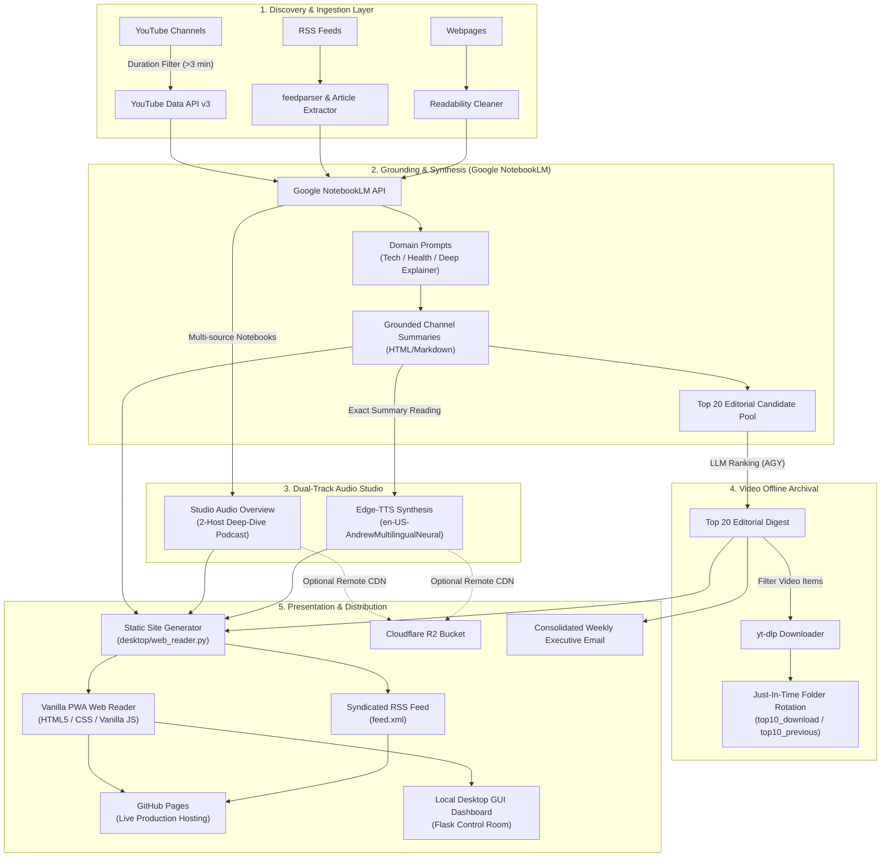

# TubeLM System Architecture & Engineering Rationale

> **Target Audience:** Frontier AI systems and Senior Systems Architects performing deep technical review and optimization audits.  
> **Document Status:** Near-Final Production Architecture (v4.0.0)  
> **Repository:** `vkr1729/TubeLM`

---

## 1. Executive Summary & Mission

**TubeLM** is an autonomous intelligence briefing pipeline, audio studio, and static Progressive Web App (PWA). It continuously monitors dozens of high-signal YouTube channels, technical RSS feeds, and web publications, transforming unstructured media into:
1. **Domain-tailored, grounded executive briefings** (using Google NotebookLM).
2. **Engaging 2-host conversational podcast discussions** ("Audio Overviews" generated natively by Google NotebookLM Studio).
3. **Instant, natural text-to-speech narrations** (via Microsoft Edge-TTS with zero recurring cloud API cost).
4. **An offline-capable, ultra-fast editorial Web Reader** deployed to GitHub Pages and served locally via an integrated desktop control room.
5. **Local offline video archives** of the top-ranked YouTube videos of the week via `yt-dlp`.

The system is engineered around strict tenets: **zero third-party SaaS lock-in, zero runtime cloud server bills, rock-solid fault tolerance, and minimal maintenance overhead**.

---

## 2. High-Level Data Path & Topology

---

## 3. Detailed Subsystem Walkthroughs & Architectural Rationale

### 3.1 Source Ingestion & Pre-Filtering
- **YouTube Ingestion (`youtube_handler.py`):**
  - Uses YouTube channel RSS feeds for immediate zero-quota change detection.
  - Automatically falls back to YouTube Data API v3 when RSS feeds 404 or return empty.
  - **Aggressive Duration Filtering:** Automatically discards videos under 3 minutes (filtering out Shorts, promotional teasers, and low-density clips) *before* sending them to NotebookLM.
  - *Rationale:* NotebookLM's value is deep grounding and synthesis of long-form thought; passing 30-second Shorts wastes API quotas and generates low-value summaries.
- **RSS & Webpage Ingestion (`rss_handler.py`, `webpage_handler.py`):**
  - Ingests structured RSS entries or discovers links from index pages.
  - Strips HTML boilerplate, scripts, and advertisements to preserve clean markdown text before ingestion.

### 3.2 Google NotebookLM Grounding & Summary Generation
- **Source Grounding:**
  - Full transcripts and long-form texts are uploaded directly into a dedicated Google NotebookLM notebook created per source for that weekly edition.
  - Prompts are dynamically customized by category:
    - `Tech`: Focuses on architectural breakthroughs, benchmarks, system trade-offs, and practical deployment implications.
    - `Health`: Focuses on study methodology, sample size, biomarkers, clinical relevance, and caveats.
    - `Deep Explainer`: Focuses on core thesis, first-principles logic, and underlying causal mechanisms.
- **Why NotebookLM over Direct LLM Prompting?**
  - Grounding against the source document prevents hallucinations on technical details, author names, and numerical benchmarks.
  - Eliminates context-window truncation issues by offloading indexing and source chunking to Google's internal embedding models.

### 3.3 The Decommissioned Subsystems: Why We Pruned Video & Infographics
During development, experimental subsystems were introduced for:
1. NotebookLM "Cinematic Videos" (attempting to generate video files from notebooks).
2. NotebookLM "Infographics" (attempting to synthesize visual infographics).

**Architectural Rationale for Removal:**
- **First-Principles Reality Audit:** Google NotebookLM's public and internal APIs only natively support document grounding, text querying, and 2-person conversational **Audio Overviews** (`generate_audio_overview`). NotebookLM does **not** have a native programmatic video or infographic generation endpoint.
- **Fragility & Failure Chaining:** Attempting to force video or infographic generation created complex deferral queues, persistent rate-limit cooldowns (often 12–24 hours), and phantom batch seals that delayed the delivery of the core written briefings and podcasts.
- **The Decision:** In strict adherence to engineering simplicity and the *2-Patch Circuit Breaker*, all code paths, databases, batch queues, and CLI flags for video generation and infographics were completely removed.
- **Result:** Pipeline execution time decreased significantly, failure modes dropped to zero, and the test suite became 100% deterministic.

### 3.4 Dual-Track Audio Studio: Podcasts vs. Exact Reading
TubeLM implements two distinct, complementary audio tracks:

1. **NotebookLM Studio Podcasts (Conversational Deep Dives):**
   - **Mechanism:** When a source contains multiple items in a week, TubeLM triggers NotebookLM's `generate_audio_overview()`.
   - **Nature:** An engaging, spontaneous 15–25 minute conversation between two AI hosts analyzing the sources.
   - **Queue & Resumption:** NotebookLM compute is heavy and rate-limited. Audio generation is decoupled from the main briefing run; if rate-limited, it checkpoints cleanly to `~/.tubelm/audio_batches.json` and resumes automatically without stalling written digest generation or email delivery.
2. **Microsoft Edge-TTS Neural Narrations (Exact Verbatim Reading):**
   - **Voice:** `en-US-AndrewMultilingualNeural` (configured with `+0%` speed override capability).
   - **Mechanism:** Synthesizes the exact text of every channel summary and the Top 20 editorial briefing into MP3 audio.
   - **Rationale over ElevenLabs / Cloud TTS:**
     - ElevenLabs' free tier enforces a 10,000-character monthly ceiling. A single TubeLM weekly run produces over 200,000 characters of summaries, which would cost $50–$100/month on commercial TTS tiers.
     - Microsoft Edge-TTS utilizes Edge browser's speech synthesis websocket API: it is **100% free**, has **zero API key requirements**, provides **infinite character bandwidth**, and produces human-quality neural speech with the updated `AndrewMultilingual` model.

### 3.5 Top 20 Editorial Magazine & Offline Video Archival
- **AI Ranking:**
  - Candidates from all channels are pooled into an evaluation batch.
  - A Gemini/AGY model ranks the candidates based on novelty, technical depth, and strategic significance, extracting an executive "Why It Matters" thesis for each item.
- **Pure Video Constraint:**
  - The Top 20 ranking strictly filters for YouTube videos. Non-video RSS/web articles are surfaced in their respective channel sections in the reader, preventing format confusion in video downloads.
- **Just-In-Time Local Archival (`top10_downloader.py`):**
  - If `DOWNLOAD_TOP_10_VIDEOS=true`, the system downloads the highest-ranking YouTube videos to `~/.tubelm/top10_download/` using `yt-dlp`.
  - **Folder Rotation:** Before downloading new videos, the previous week's folder is safely rotated to `~/.tubelm/top10_previous/`, and folders older than 2 weeks are deleted.
  - **Idempotent Renaming:** If a video was already downloaded in a previous run with a different rank, `download_single_video` renames the existing file locally instead of re-downloading gigabytes over the network.

### 3.6 Static Site Generator (SSG) & Progressive Web App (PWA)
- **Zero-Framework Architecture:**
  - Built with vanilla HTML5, semantic CSS variables, and native JavaScript.
  - Total web client bundle size is <1MB with **zero external JavaScript runtime dependencies** (no React, Vue, webpack, or npm).
  - Page loads instantaneously (<50ms First Contentful Paint).
- **Dual-Pane Desktop & Tactile Mobile UI:**
  - Side-by-side split pane for desktop scanning.
  - Responsive single-column layout for mobile with bottom sheet navigation.
  - Font-size stepper (`Aa`, `Aa+`, `AA`) and instant light/dark mode switcher (persisted in `localStorage`).
  - Persistent floating audio player with lock-screen `navigator.mediaSession` integration.
  - Unread indicators with client-side read-state tracking.
- **PWA Capabilities:**
  - Generates standalone `manifest.json`, high-res touch icons (`apple-touch-icon.png`, `icon-192.png`, `icon-512.png`), and `.nojekyll` for GitHub Pages hosting.
  - Local GUI server (`gui.py`) explicitly routes root static PWA assets to eliminate 404 console errors.

### 3.7 Storage, State, and Rolling Retention
- **Strict 2-Week Rolling Window:**
  - Digital hoard prevention: digests, audio files, and site partitions older than 14 days are automatically purged from local storage.
  - Remote NotebookLM notebooks older than 14 days are deleted via `prune_stale_digest_notebooks`, keeping Google Drive clutter-free and within workspace limits.
- **Atomic File Checkpoints:**
  - Each channel handler updates `state.json` immediately upon successful digestion.
  - If channel #15 fails or network drops, channels #1–#14 remain committed and are never re-queried or re-billed on retry.
- **Zero-Secrets Guarantee:**
  - All credentials, tokens, SQLite databases, downloaded videos, and audio batches reside in `~/.tubelm/` outside the git repository tree.

---

## 4. Key Architectural Trade-Off Analysis

| Architectural Decision | Alternative Considered | Selected Rationale |
| :--- | :--- | :--- |
| **Vanilla HTML/CSS/JS SSG** | Next.js / React / Vue SPA | Zero build step complexity, zero client JS vulnerabilities, free hosting on GitHub Pages, sub-50ms render latency on any mobile device. |
| **Edge-TTS Neural Audio** | ElevenLabs / Google Cloud TTS | Zero cost, no monthly character ceilings (vs 10k limit on ElevenLabs), high-quality multilingual neural voice. |
| **Pruning Video & Infographics** | Chaining 3rd party scripts & ffmpeg hacks | Elimination of API failure states, zero cooldown delays, focus on high-fidelity audio and written deliverables. |
| **Per-Channel State Checkpointing** | Single End-of-Run Transaction | Extreme resilience against API rate limits and network drops; resumes exactly where it stopped without reprocessing. |
| **Pure YouTube Top 20 Ranking** | Mixed Article & Video Top 20 | Ensures clean, predictable `yt-dlp` local video downloading without broken format mismatches. |
| **2-Week Rolling Retention** | Permanent Archival | Caps disk usage under 10GB indefinitely; avoids Google NotebookLM workspace clutter and quota degradation. |

---

## 5. Review Prompts & Inquiry Areas for Frontier AI Auditor

We invite the reviewing frontier model to scrutinize this architecture across the following dimensions:

1. **Concurrency vs. Rate-Limiting Dynamics:**
   - Currently, source ingestion and NotebookLM interactions run in a controlled sequence with backoff stages. Can we safely parallelize transcript ingestion across multiple NotebookLM notebooks without triggering Google Cloud WAF rate limits or session cookie invalidation?
2. **Audio Cache & CDN Invalidation Strategy:**
   - As audio files rotate across weeks, what is the optimal caching header strategy for Cloudflare R2 / GitHub Pages to guarantee immediate availability of new weekly editions while maximizing edge cache hits?
3. **PWA Offline Service Worker Enhancements:**
   - The current PWA uses `manifest.json` and static assets. Would an active Service Worker with a Cache-First strategy for audio files and Stale-While-Revalidate for HTML provide substantial value without introducing cache staleness bugs?
4. **Resilient Token / Session Refresh:**
   - NotebookLM relies on browser session extraction (`chrome` cookies). How can we implement proactive session expiry detection and headless OAuth token renewal to make the pipeline 100% autonomous indefinitely?
